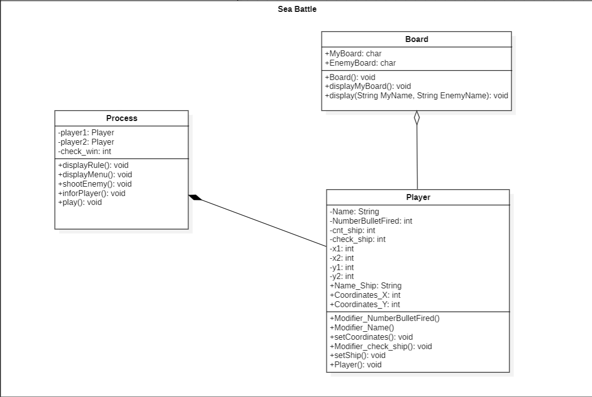
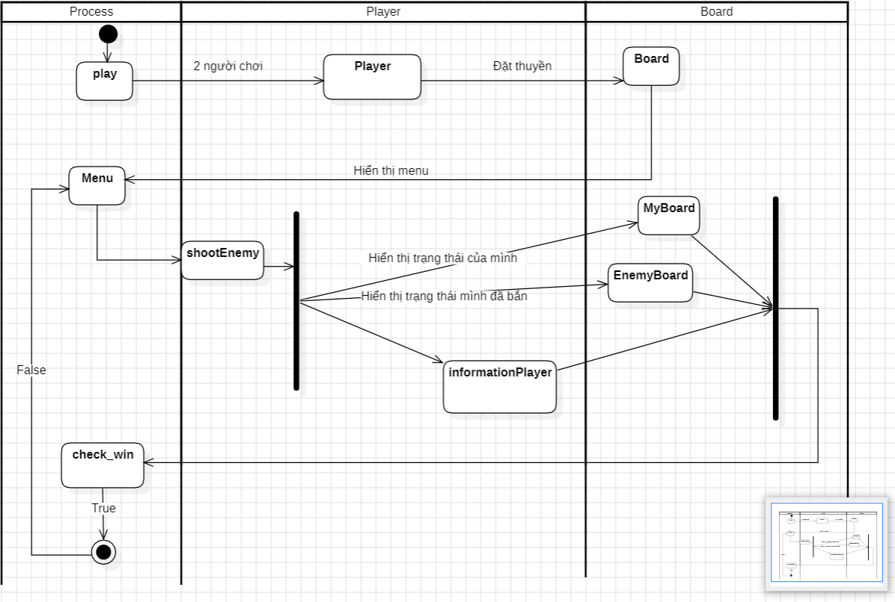

# Sea Battle
Sea Battle là một trò chơi dành cho hai người chơi. Trò chơi được chơi trên bốn lưới, hai cho mỗi người chơi. Các lưới thường là vuông - thường là 10 × 10 - và các ô riêng lẻ trong lưới được xác định bằng chữ cái và số. Trên một lưới, người chơi sắp xếp các tàu và ghi lại các phát bắn của đối thủ. Trên lưới còn lại, người chơi ghi lại các phát bắn của riêng mình.
- Là một người chơi, tôi có thể vào game và bắt đầu chơi. Sẽ có hai người chơi trong một ván game và lượt sẽ được luân phiên.

#### 📝 Vòng chuẩn bị
- Ban đầu, người chơi được cho 1 bảng 10x10, một cột đánh từ A->J, một cột đánh từ 1->10. Mỗi người chơi sở hữu 5 con thuyền như sau:
    - 2 Thuyền Tuần Tra (Patrol Boat) 1x2
    - 1 Tàu Khu Trục (Destroyer Boat) 1x4
    - 1 Tàu Ngầm (Submarine) 1x3
    - 1 Thiết Giáp Hạm (Battle Ship) 1x5

- Người chơi sẽ có thể nhập vào 2 toạ độ (X,Y) với từng mẫu thuyền để đặt thuyền, màn hình sẽ hiển thị thuyền lên bảng. Sau khi đặt xong hết, sẽ sang lượt đặt của người kia.

---
#### 📝 Luật trò chơi
- 1 tàu sẽ bị phá huỷ chỉ sau khi toàn bộ điểm bị phá hết. ví dụ tàu 1x5 thì ít nhất 5 phát bắn trúng đích toàn bộ để phá
- Khi bên nào bị phá hết tàu trước lập tức thua cuộc và - hiển thị màn hình kết quả, bảng của cả 2 bên
## Ảnh demo

## Video demo :
[SeaBattle](https://www.youtube.com/watch?v=uJ4Bco0oErA)

# UML

